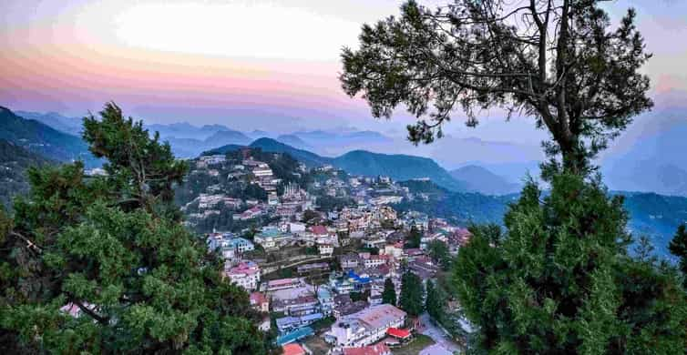
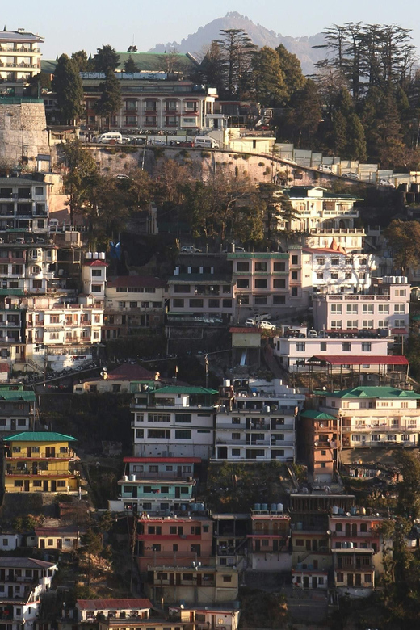
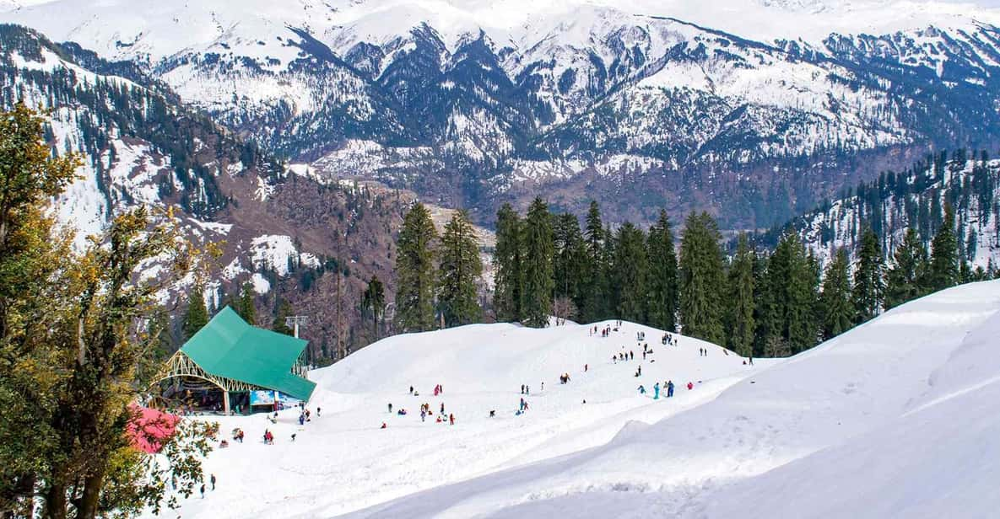

<!DOCTYPE html>
<html lang="en">
<head>
    <meta charset="UTF-8">
    <meta name="viewport" content="width=device-width, initial-scale=1.0">
    <title>DOCUMENT</title>
    

</head>
<body>
       <header><!-- NAVIGATION BAR -->
       
        
      <label for="LANGUAGE">LANGUAGE</label>

      
      <select name="LANGUAGE" id="LANGUAGE">
        <option value="ENGLISH UK">ENGLISH UK</option> </option>
        <option value="FRENCH">FRENCH</option>
        <option value="POURTUGUESE">PORTUGUESE</option>
        <option value="SPANISH">SPANISH</option>
'

          </select>

<!-- HOME  -->
          
<a href="businesspage.html">HOME</a>

          <!-- HELP  -->
     
<a href="https://www.flipkart.com/helpcentre?catalog=55c9c8e2b0000023002c1702&view=CATALOG">HELP (FAQs)</a> 
 

     <!-- CONTACT US -->
      
<a href="contactus.html">CONTACT US</a>

      <!-- LOGIN  -->
      
<a href="login.html">Login/Register</a>

      <!-- CUSTOMER CARE -->
      
<a href="">CUSTOMER CARE</a>

       </header>
   
    
    
        

          
        
    

          <!-- Hero Section -->
     <!-- HEADER -->
    <header style="background-color: rgb(167, 186, 135);">
     
  
       <h1> <ins style="margin: 500px";>WELCOME TO EASY JOURNEY </ins> </h1>

       <!-- Tagline -->
  
        <h2><em style="margin-left: 650px;"> Get Ready to Travel!   </em> </h2>
      </header>

        
      

      <!-- About us section -->

      <h2>
        ABOUT US: </h2>
 
   <strong style="background-color:bisque;color: red;">WHY EASY JOURNEY? </strong>
  
  <li>Establised in 2004. Easy Journey has been positioned as providing great offers
   quality,service,exclusive discounts, and a wide range of online booking experience  to many of its customers.</li>

 
<li> With our exceptional people and carefully selected global partners, we curate and support a trip for you that goes beyond your expectations  with access to the places and moments you have dreamed of.</li>
  

<!-- Services Section -->
 

<h3><u style="background-color:bisque ;color:red;">SERVICES WE OFFER : </u>
</h3>
<!-- TABLE FOR SHOWING SERVICES -->

 <table border =4>
  <tr><th>PLACES </th>
  <th>DESCRIPTION</th>
<th>PRICE PER PERSON</th>
<th>BOOKING STATUS </th>
</tr>
<!-- MUSSOORIE -->
<tr><td>1) MUSSOORIE TRIP</td>
<td>2 DAY TRIP   
  Discover the charm of Mussoorie on this full-day guided tour, exploring the most iconic 
   spots in the Queen of Hills.
   Enjoy a peaceful walk along Camel's Back Road and take in the breathtaking 
   vistas at Lal Tibba, 
  the highest point in Mussoorie. <Table></Table></td>
<td><strong>7000/- PER PERSON</strong></td>
<td><a href="booknow.html"><input type="button" value="BOOK NOW!" style="background-color :rgb(181, 174, 154);"></a></td>
<td><input type="button" value="Add to Cart" onclick="alert('ADDED TO CART!')"></td>
</tr>
 </table>
  
 
 
   
 <table border="4">
  <!-- MANALI -->
  <tr><td>2)MANALI TRIP </td>
<td>
  3 DAY TRIP : Spend days exploring the beautiful hill station of Manali on a private tour from Delhi.
    Visit the Hidimba Temple, Vasistha Muni Temple, and the Tibetan Market. 
   Enjoy a day trip to Rohtang La Pass and take part in adventure activities in Solang Valley.</td>
  <td><strong>14000/- PER PERSON </strong> </td>
  <td><a href="booknow.html" ><input type="button" value="BOOK NOW!" style="background-color :rgb(181, 174, 154);"></a></td>
  <td><input type="button" value="Add to Cart" onclick="alert('ADDED TO CART!')"></td>
  </tr>
 </table>
  
 
 
  
 <table border="4">
  <tr><td>

    <!-- SHIMLA-->

    3) SHIMLA TRIP
  </td>
<td>2 DAY TRIP : Explore the Shimla a beautiful township nestled in the picturesque valley.
   
  Pass through the many colonial building and an important landmark of Shimla
  Visit on Mall road 
    a wide open street has everything for a Shopping person</td>
  <td><strong>6000/- PER PERSON </strong></td>
  
  <td><a href="booknow.html"><input type="button" value="BOOK NOW!" style="background-color :rgb(181, 174, 154);"></a></td>
  <td><input type="button" value="Add to Cart" onclick="alert('ADDED TO CART!')"></td>

  </tr>
  
 </table>
  
 

 
  
  
<table border="4">

  <!-- RISHIKESH -->
  <tr><td>4)RISHIKESH</td>
  <td>Feel the thrill of white-water rafting on the Ganges River
    Immerse yourself in the spiritual atmosphere of Rishikesh  
    Take part in a traditional yoga session at an ashram 
     
    Witness the Ganga Aarti ceremony at Triveni Ghat
     
    Enjoy a peaceful meditation session by the Ganges River
  </td>
  <td><strong>5000/- Per Person</strong></td>
  <td><input type="button" value="BOOK NOW!" style="background-color :rgb(181, 174, 154);"></a></td>
  <td><input type="button" value="Add to Cart" onclick="alert('ADDED TO CART!')"></td>
</tr>
</table>
 

 

  
 
<!-- KEY FEATURES OF EASY JOURNEY -->

<H3> CUSTOMER FRIENDLY FEATURES : </H3>
<ul>
  
  <li >
   <strong style="background-color: rgb(154, 225, 226);"> FREE Cancellation (Upto 24 hours)</strong>
  </li>
  
  <li><strong style="background-color: rgb(154, 225, 226);">Reserve now & pay later</strong></li>
  <li><strong style="background-color: rgb(154, 225, 226);">Live tour guide (English Spanish French)</strong></li>
  <li><strong style="background-color: rgb(154, 225, 226);">Pick up  Included</strong></li>
  <li><strong style="background-color: rgb(154, 225, 226);">24/7 CUSTOMER CARE SERVICE </strong></li>
  <li><strong style="background-color: rgb(154, 225, 226);">Immediate Booking Confirmation </strong>
  </li>
  </ul>
    

  <!-- TESTIMONIALS -->

  

<H2 ><mark>OUR TESTIMONIALS : </mark> </H2>

 

<!-- USER 1 -->

<strong>SHIVAM (User since 2 years booked more then 5 trips)</strong>

<em> </li>  Highly recommended tour.   for those who don't have much time available and want to take a super smart day trip.  It's several hours of travel but it's well spent! Fantastic experience,   I had the pleasure of finding Atharva,  a young guide who accompanied me on one of the most evocative experiences I have had in India.  Competent, friendly, very helpful and prepared.  I recommend anyone who is in Delhi and wants to escape the chaos of the city to  take a day off and take a tour of Rishikesh with this agency!</em> 

 

<!-- USER 2 -->

<strong>RAHUL (User since 1 year;booked more then 10 trips)</strong>

We loved this tour, it is a long drive but worth it. Our guide Sahdev was outstanding, he was knowledgeable and bought to life Hinduism.]
    Our driver Avhishek was brilliant, really safe👍 The evening ceremony was an experience we will treasure. Our guide sorted some of best seats with a clear perfect view. 
   
  One of our favourite tours in India 🇮🇳 They provide water and snacks in the car, hotel pick up was punctured.  
  Both the driver and guide were friendly and made the tour enjoyable. Thank you for  fantastic trip, a wonderful part of our trip to India👍👏🇮🇳

<!-- USER 3 -->

  
  <strong>ROHIT(User since 14 months booked more then 5 trips)</strong>
  

    a fantastic tour guide who went out of his way to make sure we had a great day -
      ensuring we were comfortable and well fed. We also loved learning about yoga! Despite the long journey, 
     our trip to Haridwar and Rishikesh was 100% worth it. The Aarti ceremony was particularly special and a notable experience that we will treasure forever.
  

   

  <!-- FEEDBACK FORM -->

  <h2  style=";margin-left: 600px;">FEEDBACK FORM</h2>
   
  <label for="txt"  id="txt"></label>
    <textarea style="margin-left: 350px;" id cols="100" id="" rows="20" placeholder="YOUR FEEDBACK"></textarea>
     
   <input type="button" value="submit" style="margin-left: 700px; " height="100px">

<!-- FOOTER -->

<footer style="background-color: rgb(191, 122, 122); x;" ><H3>@EasyJourney PVT-LTD</H3><H5>Country INDIA </H5> <H3 style="margin-left: 700px;">CONTACT US:</H3> 
 
  
  

  

  

</body>
</html>
